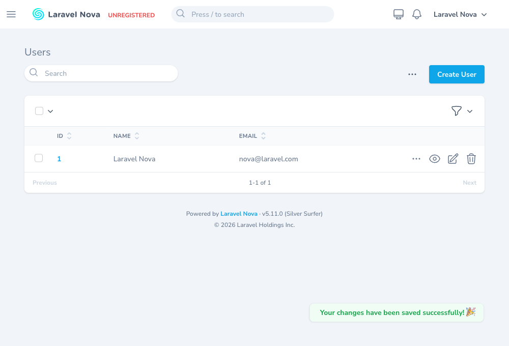

# Nova Toast

[](https://packagist.org/packages/bbs-lab/nova-toast)
[](https://github.com/BBS-Lab/nova-toast/actions)
[](https://packagist.org/packages/bbs-lab/nova-toast)

Flash a message from anywhere in your Laravel app — a controller, an observer, a
middleware, a Nova action — and have it pop up as a [Nova](https://nova.laravel.com)
toast on the next page load. No front-end wiring, no events to register.

## Screenshots



## Features

- 🍞 Four static helpers — `Toast::success/warning/error/info()` — map straight to Nova's own toasts
- 🌍 Flash from **anywhere**: controllers, observers, middleware, jobs, Nova actions
- 🔌 **Zero configuration** — the service provider is auto-discovered, nothing else to wire up
- 🪶 Tiny surface: one class, one booting script, no config file, no assets to publish
- 🧪 100% line coverage, 100% MSI mutation, PHPStan level 8, no `final` classes, strict types everywhere

## Requirements

- PHP `^8.2`
- Laravel Nova `^4.0 || ^5.0`
- Laravel `^11.0 || ^12.0 || ^13.0`

Both Nova majors are exercised in CI. Note that **Nova 4** (through its `inertiajs/inertia-laravel`
dependency) tops out at **PHP 8.4** and **Laravel 11**; on PHP 8.5 or Laravel 12+, use Nova 5. Composer
resolves the right combination for you.

## Installation

Because Nova is a paid, private package, make sure your application is already authenticated against
`nova.laravel.com`, then:

```bash
composer require bbs-lab/nova-toast
```

The service provider is auto-discovered — there is nothing else to wire up.

## Usage

Call one of the static helpers wherever you have a message to surface (a Nova
action, a controller, an observer, …):

```php
use BBSLab\NovaToast\Toast;

Toast::success('Saved.');
Toast::warning('Careful with that.');
Toast::error('Something went wrong.');
Toast::info('Just so you know.');
```

The toast shows on the **next** Nova page load, so it pairs naturally with a redirect:

```php
Toast::success('Two-factor authentication enabled.');

return back();
```

## How it works

Each helper flashes `['type' => ..., 'message' => ...]` to the session under the
`nova-toast` key. On the next Nova request, the service provider hands that
payload to the front-end via `Nova::provideToScript`, and a small booting script
calls the matching `Nova.success/error/warning/info` toast. Being flash data, the
message is shown once and then cleared.

## Testing

```bash
composer test            # Pest suite
composer test-coverage   # 100% line coverage on src/
composer test-mutation   # 100% MSI (Pest mutation testing)
composer analyse         # PHPStan level 8
composer format          # Pint (laravel preset + strict types)
```

A full embedded Nova app (via [Orchestra Workbench](https://github.com/orchestral/workbench)) lets you
exercise the flow in a real Nova instance — a `Dispatch Toast` action on the Users resource flashes a
toast so you can see it live:

```bash
composer serve   # boots Nova at http://localhost:8000/nova
```

## Security

The package only moves a message string through the session flash — it captures no data and exposes no
endpoint. If you discover a security issue, please email `paris@big-boss-studio.com` instead of using
the issue tracker.

## Changelog

Please see [CHANGELOG](CHANGELOG.md) for what has changed recently.

## Contributing

Please see [CONTRIBUTING](CONTRIBUTING.md) for details.

## Credits

- [Big Boss Studio](https://github.com/BBS-Lab)

## License

The MIT License (MIT). Please see [License File](LICENSE.md) for more information.
